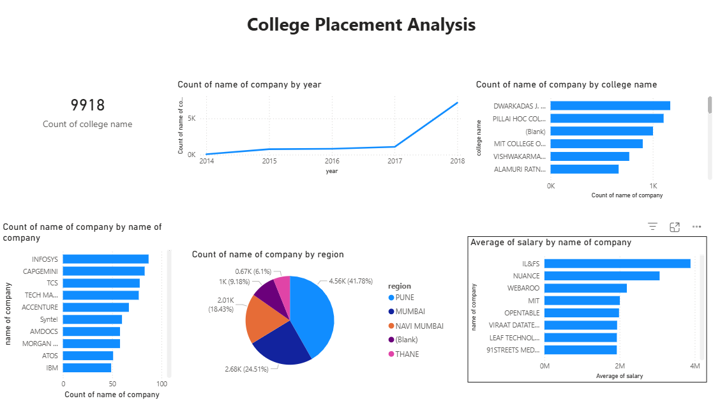

# College Placement Analysis

## Project Overview
This project analyzes college placement data to understand recruitment patterns, salary trends, and regional hiring distribution. The analysis focuses on identifying companies hiring the most students and understanding how placement activity has evolved over time

## Tools Used
- Microsoft Excel
- Power BI
- Data Cleaning
- Pivot Tables
- Data Visualization

## Dataset Features

The dataset includes the following important fields:

- Company Name
- College Name
- Region
- Salary Package
- Placement Year
  
## KPI

**Total Placement Records**

Total Records Analyzed: **9,918** placement entries 

## Key Insights

- Placement opportunities increased significantly in 2018, indicating a strong hiring trend that year.
- Infosys, Capgemini, and TCS appear among the top recruiters with the highest placement counts.
- Pune region accounts for the largest share of placements (41.78%), followed by Mumbai and Navi Mumbai.
- Some companies such as UI&FS and Nuance offer higher average salary packages compared to others.

## Dashboard

The dashboard highlights hiring trends by year, company hiring distribution, regional placement patterns, and average salary offered by recruiters.

## Business Recommendations

- Strengthen industry partnerships with top recruiting companies.
- Encourage students to prepare for companies offering higher salary packages.
- Focus training efforts on regions and companies with higher recruitment activity.
